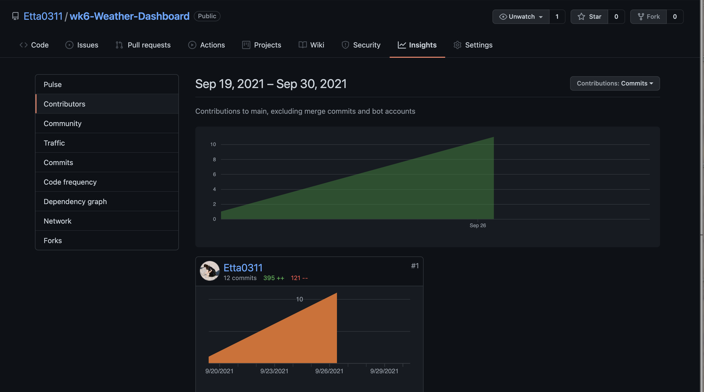

# wk6-Weather-Dashboard
Link: [weather Dashboard](https://etta0311.github.io/Weather-Dashboard/)

## Description

This work is to build a weather Dashboard from scrach which it give data of current weather and 5 day weather forecast of the city that typed in for searching.
This is the website are using an API called openweathermap.
website not only showing data when it received a user input but also called up the previous search by clicking in corresponding part.

## Table of Contents

   - Techniques used
   - Usage
   - Credits
   - License

## Techniques used

   - HTML
   - CSS
   - Javascript
   - jQuery 
   - Bootstrap
   - 

## Usage

## Contributors

## Credits
    - https://coding-boot-camp.github.io/full-stack/github/professional-readme-guid
    - https://choosealicense.com/
    - https://jquery.com/
    - https://getbootstrap.com/docs/5.1/getting-started/introduction/
    - https://openweathermap.org/api
    - https://rapidapi.com/blog/access-global-weather-data-with-these-weather-apis/
    - https://fonts.google.com/
    - https://htmlcolorcodes.com/
    - https://cssgradient.io/
    - https://developer.mozilla.org/en-US/docs/Web/JavaScript/Reference/Global_Objects/Array/indexOf
    - https://developer.mozilla.org/en-US/docs/Web/API/Document/createElement
    - https://developer.mozilla.org/en-US/docs/Web/JavaScript/Reference/Global_Objects/JSON/parse
    - https://www.w3schools.com/js/js_htmldom_eventlistener.asp
    - https://javascript.info/promise-api
    - https://developer.mozilla.org/en-US/docs/Web/JavaScript/Reference/Global_Objects/Promise
    - https://developer.mozilla.org/en-US/docs/Web/API/fetch
    
## License
MIT License

Copyright (c) [2021] [Ettaho]

Permission is hereby granted, free of charge, to any person obtaining a copy
of this software and associated documentation files (the "Software"), to deal
in the Software without restriction, including without limitation the rights
to use, copy, modify, merge, publish, distribute, sublicense, and/or sell
copies of the Software, and to permit persons to whom the Software is
furnished to do so, subject to the following conditions:

The above copyright notice and this permission notice shall be included in all
copies or substantial portions of the Software.

THE SOFTWARE IS PROVIDED "AS IS", WITHOUT WARRANTY OF ANY KIND, EXPRESS OR
IMPLIED, INCLUDING BUT NOT LIMITED TO THE WARRANTIES OF MERCHANTABILITY,
FITNESS FOR A PARTICULAR PURPOSE AND NONINFRINGEMENT. IN NO EVENT SHALL THE
AUTHORS OR COPYRIGHT HOLDERS BE LIABLE FOR ANY CLAIM, DAMAGES OR OTHER
LIABILITY, WHETHER IN AN ACTION OF CONTRACT, TORT OR OTHERWISE, ARISING FROM,
OUT OF OR IN CONNECTION WITH THE SOFTWARE OR THE USE OR OTHER DEALINGS IN THE
SOFTWARE.
=======
